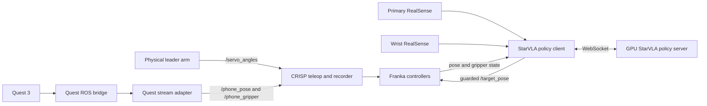

# Franka VLA Deployment and Teleoperation Workspace

ROS 2 workspace for operating a Franka robot, collecting dual-camera demonstrations with either a physical leader arm or a Meta Quest 3 controller, and deploying StarVLA policies through a guarded client/server interface.

This repository intentionally contains only the Franka deployment and teleoperation stack. Spatial Forcing, VGGT/SAM2 experiments, RL training, and their audit scripts are not part of this branch.

> **Safety:** this software can command a physical robot. Keep the emergency stop within reach, start with low-speed dry runs, verify camera/state freshness and workspace limits, and add `--execute` only after inspecting the predicted actions.

## System overview



The policy server performs neural-network inference on a GPU machine. The ROS client runs beside the robot, gathers both camera views and robot state, applies action/workspace/gripper safety checks, and publishes commands only when `--execute` is supplied.

## Repository layout

| Path | Purpose |
| --- | --- |
| `src/leader_arm` | Serial reader for the physical 7-DoF leader arm plus gripper; publishes `/servo_angles`. |
| `src/crisp_gym` | Franka environments, leader/Quest teleoperation, dual-camera observations, and LeRobot recording. |
| `src/crisp_py` | Python interface used by CRISP to command the Franka and gripper. |
| `src/crisp_controllers*` | ROS 2 controllers, Franka launch files, and controller configuration. |
| `src/piper-vr-teleop` | Quest 3 OpenXR/ADB transport and native passthrough application. |
| `src/camera_driver` | Dual-RealSense Docker configuration. |
| `src/franka_ros2`, `src/franka_description`, `src/libfranka` | Franka ROS 2 and hardware dependencies. |
| `third_party/starVLA` | StarVLA policy framework and WebSocket policy server. |
| `scripts` | Deployment clients, dry-run probes, open-loop evaluation, camera checks, and robot return utilities. |
| `patches/nested_repos` | Project-specific changes applied on top of pinned Git submodules. |

## Hardware and software

The current setup targets:

- Franka FR3 with Franka Hand;
- a serial leader arm on `/dev/ttyUSB0`, or a Meta Quest 3;
- one primary and one wrist Intel RealSense camera;
- Ubuntu with ROS 2 Humble;
- Docker for the RealSense drivers;
- Python 3.10 or newer;
- a CUDA-capable inference server for StarVLA;
- ADB, Android SDK/NDK, and CMake 3.22.1+ when building the Quest native application.

Robot IP addresses, camera serial numbers, ROS namespaces, and filesystem paths are installation-specific. Review them before starting hardware.

## Clone and bootstrap

Clone all pinned dependencies and apply the project patches once:

```bash
git clone --recurse-submodules https://github.com/jason-0712/franka_ws.git
cd franka_ws
bash scripts/apply_nested_repo_patches.sh
```

The applied patches intentionally leave several submodules marked with a lowercase `m` in `git status`. The authoritative, portable copies of those modifications are the files under `patches/nested_repos`.

Install the Python packages used by the teleoperation stack:

```bash
python3 -m pip install -e src/crisp_py
python3 -m pip install -e src/crisp_gym
python3 -m pip install pyserial
```

Build the ROS workspace:

```bash
source /opt/ros/humble/setup.bash
rosdep install --from-paths src --ignore-src -r -y
colcon build --symlink-install
source install/setup.bash
```

Use the same ROS settings in every robot-side terminal:

```bash
export ROS_DOMAIN_ID=30
export RMW_IMPLEMENTATION=rmw_cyclonedds_cpp
source /opt/ros/humble/setup.bash
source /absolute/path/to/franka_ws/install/setup.bash
```

## Start the dual RealSense cameras

The supplied compose file starts the primary camera with aligned depth and the wrist camera in RGB-only mode:

```bash
cd src/camera_driver
docker compose -f docker-compose.dual-franka.yaml up -d
docker logs -f franka_dual_realsense
```

Before use, update both `serial_no` values in `src/camera_driver/docker-compose.dual-franka.yaml`. The default RGB topics expected by the policy client are:

```text
/right/right_third_person_camera/color/image_raw
/right/right_wrist_camera/color/image_raw
```

Capture one frame from each view without moving the robot:

```bash
python3 scripts/capture_ros_camera_frames.py --output-dir camera_frames_current
```

## Start the Franka controllers

```bash
ros2 launch crisp_controllers_robot_demos franka.launch.py \
  arm_id:=fr3 \
  robot_ip:=172.16.0.2 \
  use_fake_hardware:=false \
  use_rviz:=false
```

Physical leader-arm teleoperation expects `joint_impedance_controller` to accept `/target_joint`. StarVLA delta-pose deployment expects `cartesian_impedance_controller` to accept `/target_pose`. Activate only the controller required for the current experiment and confirm the controller state first:

```bash
ros2 control list_controllers
```

`scripts/restart_franka.sh` is an optional restart loop. Its `WORKSPACE_SETUP` placeholder must be changed to the local absolute `install/setup.bash` path before use.

## Physical leader-arm teleoperation

Build/source the workspace, connect the leader arm, and start its serial reader:

```bash
ros2 run leader_arm servo_reader.py --ros-args \
  -p serial_port:=/dev/ttyUSB0 \
  -p baudrate:=115200 \
  -p publish_rate:=10.0
```

Verify that eight values are being published:

```bash
ros2 topic echo /servo_angles --once
```

Before teleoperation, activate the joint controller according to the local controller configuration. Then record a local dual-camera dataset:

```bash
crisp-record-leader-follower \
  --repo-id snkdjn/franka_leader_demo \
  --tasks "pick up the cube and place it on the box" \
  --follower-config dual_cam_franka \
  --fps 15 \
  --num-episodes 20 \
  --use-servo-leader \
  --no-push-to-hub
```

The first leader-arm sample defines the relative joint zero for that session. Start both arms from the intended home configuration and move slowly during the first test.

## Quest 3 teleoperation

The Quest path has three components:

1. `quest_reader_ros_bridge.py` publishes raw controller pose and buttons;
2. `crisp-quest3-stream-adapter` converts controller motion to `/phone_pose` and `/phone_gripper`;
3. `crisp-record-leader-follower --use-quest3-controller` controls and records the Franka.

USB connection:

```bash
python3 scripts/quest_reader_ros_bridge.py \
  --connection usb \
  --piper-repo /absolute/path/to/franka_ws/src/piper-vr-teleop
```

Wireless ADB connection:

```bash
adb connect QUEST_IP:5555

python3 scripts/quest_reader_ros_bridge.py \
  --connection wireless \
  --quest-ip QUEST_IP \
  --piper-repo /absolute/path/to/franka_ws/src/piper-vr-teleop
```

Start the safe stream adapter without direct `/target_pose` publication:

```bash
crisp-quest3-stream-adapter --ros-args \
  -p publish_target_pose:=false \
  -p translation_scale:=0.15 \
  -p max_translation_step:=0.03
```

Verify its outputs before starting the recorder:

```bash
ros2 topic echo /phone_pose --once
ros2 topic echo /phone_gripper --once
```

Record:

```bash
crisp-record-leader-follower \
  --repo-id snkdjn/franka_quest3_demo \
  --tasks "pick up the cube and place it on the box" \
  --follower-config dual_cam_franka \
  --fps 15 \
  --num-episodes 20 \
  --use-quest3-controller \
  --no-push-to-hub
```

The native Quest passthrough application and its build requirements are documented in `src/piper-vr-teleop/quest_mr_passthrough_native/README.md`.

## StarVLA deployment

### 1. Start the GPU policy server

On the inference server:

```bash
cd /absolute/path/to/franka_ws/third_party/starVLA

python deployment/model_server/server_policy.py \
  --ckpt_path /absolute/path/to/checkpoint/pytorch_model.pt \
  --port 10096 \
  --use_bf16 \
  --idle_timeout -1
```

The checkpoint must include its matching model configuration and normalization statistics. Image count/order, image preprocessing, proprioceptive state, action representation, and normalization must match training.

### 2. Check connectivity

On the robot computer:

```bash
python3 - <<'PY'
import socket

with socket.create_connection(("POLICY_SERVER_IP", 10096), timeout=3):
    print("POLICY_SERVER_CONNECTION=PASS")
PY
```

### 3. Run a no-motion snapshot probe

```bash
python3 scripts/starvla_live_snapshot_probe.py \
  --policy-host POLICY_SERVER_IP \
  --policy-port 10096 \
  --label preflight \
  --output-dir deployment_logs/live_probe/preflight
```

This script sends no robot commands and should report `ROBOT_COMMANDS_SENT=0`.

### 4. Run the policy client in dry-run mode

Omit `--execute`:

```bash
python3 scripts/starvla_franka_delta_pose_client.py \
  --policy-host POLICY_SERVER_IP \
  --policy-port 10096 \
  --task "pick up the cube and place it on the box" \
  --max-steps 8 \
  --execution-horizon 1 \
  --log-timing
```

Check image topics, state freshness, action units/signs, predicted gripper state, workspace bounds, and command ownership. Dry-run mode does not publish `/target_pose`.

### 5. Execute on the real robot

Only after the dry run is validated, repeat the same command with:

```text
--execute
```

Do not enlarge workspace bounds merely to bypass an abort. An abort is evidence that the observation/action contract, initial condition, controller, or policy behavior needs investigation.

## Offline evaluation

Evaluate a checkpoint against recorded LeRobot episodes without commanding the robot:

```bash
python3 scripts/starvla_open_loop_l2_eval.py \
  --policy-host POLICY_SERVER_IP \
  --policy-port 10096 \
  --dataset-root /absolute/path/to/dataset/snkdjn \
  --ids quest3_franka_dualcam_test_0047 \
  --stride 5 \
  --compare both \
  --output-csv deployment_logs/open_loop/result.csv
```

Use `starvla_requery_saved_snapshot.py` to replay previously saved observations and `starvla_delta_joint_policy_smoke_test.py` for the delta-joint policy interface.

## Safety checklist

Before every real-robot execution:

- verify the emergency stop and Franka Desk state;
- remove other publishers from `/target_pose` or `/target_joint`;
- confirm the intended controller is active;
- confirm both camera frames are current and correctly ordered;
- confirm `/current_pose` and gripper state are fresh;
- start from the same safe home configuration used during data collection;
- run the snapshot probe and dry-run client first;
- keep conservative translation, rotation, and XYZ workspace limits;
- use a single grasp attempt until behavior is repeatable;
- stop immediately after stale observations, network loss, unexpected contact, or workspace aborts.

## Maintaining nested-repository changes

After intentionally editing one of the retained submodules, regenerate the portable patch files:

```bash
bash scripts/export_nested_repo_patches.sh
git add patches/nested_repos
```

On a fresh clone, apply them once with:

```bash
bash scripts/apply_nested_repo_patches.sh
```

The patch set currently covers CRISP Franka support, leader/Quest recording integration, Quest transport changes, and the small StarVLA deployment wrapper change. It does not contain SF or RL code.

## Test

Run the retained client safety test:

```bash
python3 -m unittest tests/test_starvla_synchronized_close_hold.py
```

Basic repository audit:

```bash
test -f src/leader_arm/servo_reader.py
test -f scripts/starvla_franka_delta_pose_client.py
test -f third_party/starVLA/deployment/model_server/server_policy.py
git submodule status
```

## Third-party software

This workspace pins several upstream projects as Git submodules. Their original licenses and notices remain in their respective directories. Review all hardware, dataset, model-checkpoint, and third-party licenses before redistribution.
