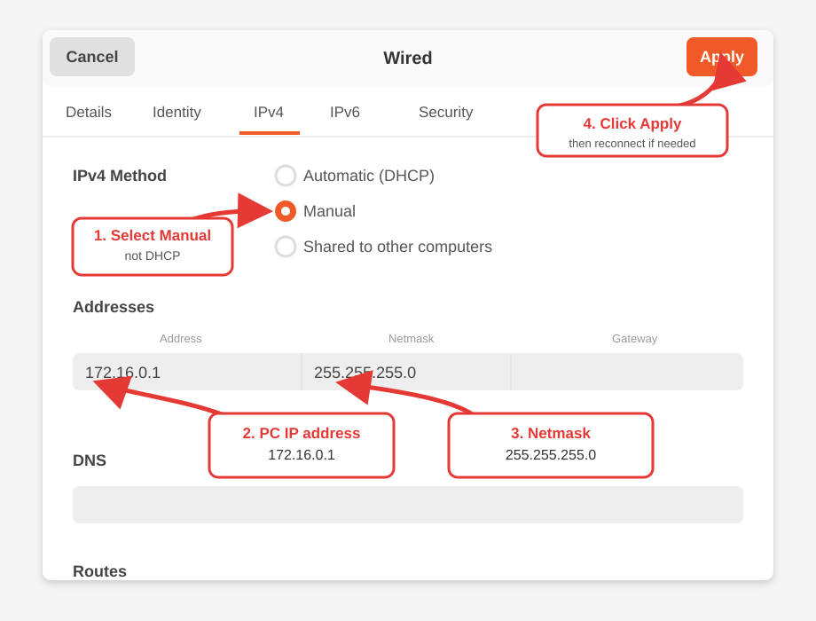
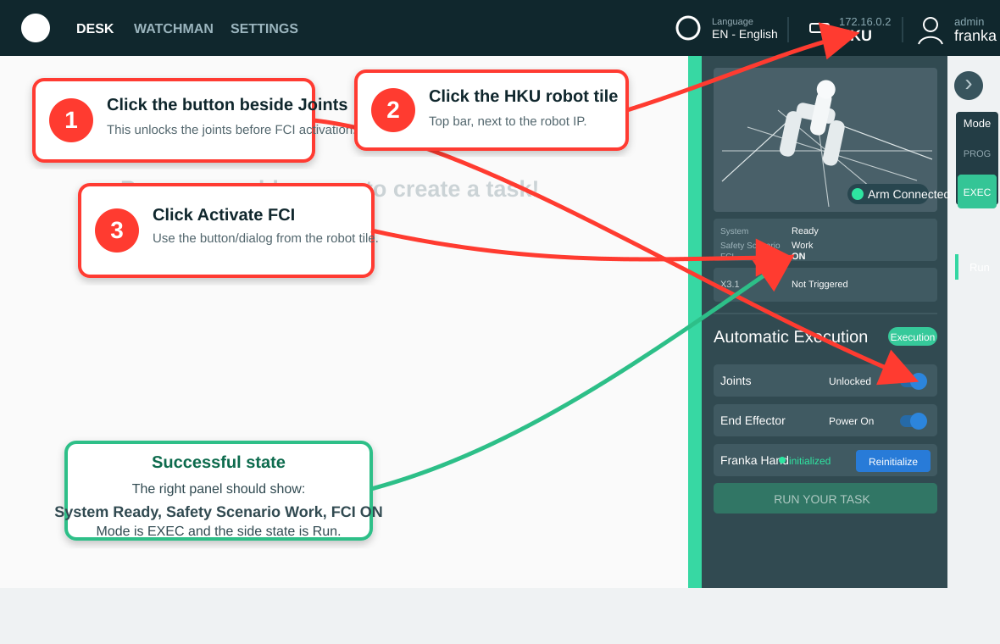

# Franka Workspace

ROS 2 Humble workspace for running a Franka FR3 with CRISP controllers, RealSense
cameras, leader-arm teleoperation, LeRobot-format recording, and VLA policy
deployment experiments.

This repository is a lab workspace rather than a single upstream package. It
contains vendored Franka/CRISP code, local launch/config files, Docker
environments, and experiment scripts that are meant to work together from
`/home/dase-hw101/franka_ws`.

The usual workflow is:

1. Configure the wired PC network to talk to the robot.
2. Open Franka Desk, unlock the robot, and activate FCI.
3. Start the camera container if observations/images are needed.
4. Start the FR3 ROS 2 controller launch.
5. Run one of the Python clients for teleoperation, data recording, or VLA
   deployment.

For the concise data-collection runbook, see [DATA_COLLECTION.md](DATA_COLLECTION.md).
For the planned Meta Quest 3 controller input path, see
[QUEST3_FRANKA_TELEOP.md](QUEST3_FRANKA_TELEOP.md).

## What is in this workspace

| Path | Purpose |
| --- | --- |
| `src/franka_ros2` | Franka ROS 2 packages, bringup, hardware interface, gripper, messages, example controllers. |
| `src/libfranka` | Franka C++ client library. |
| `src/franka_description` | FR3/Franka URDF, SRDF, xacro, meshes, and RViz configs. |
| `src/crisp_controllers` | Real-time `ros2_control` CRISP controllers, including Cartesian and joint impedance control. |
| `src/crisp_controllers_demos` | Demo launch files, FR3 configs, MuJoCo simulation interface, and the main Docker setup. |
| `src/crisp_py` | Python interface and examples for controlling robots with CRISP controllers. |
| `src/crisp_gym` | Gymnasium/LeRobot recording and policy deployment utilities. |
| `src/franka_broadcasters` | External torque/wrench broadcaster plugins. |
| `src/leader_arm` | Local ROS 2 package for reading serial servo leader-arm angles on `/servo_angles`. |
| `src/camera_driver` | Local RealSense container config for the third-person camera. |
| `dataset` | Local cache/mount point for LeRobot/Hugging Face datasets. |
| `QUEST3_FRANKA_TELEOP.md` | Planned Quest 3 controller teleoperation path for Franka. |

## Hardware Setup

- Franka FR3 reachable at `172.16.0.2`.
- Control PC wired interface configured as `172.16.0.1`.
- Franka Desk reachable at `https://172.16.0.2/desk/`.
- RealSense camera container named `realsense_ros2` when using
  `src/camera_driver/docker-compose.yaml`.
- Leader arm on `/dev/ttyUSB0` unless overridden with ROS parameters.

### 1. Configure The Wired IPv4 Address

Open Ubuntu network settings for the wired connection and set IPv4 to
`Manual`. The PC side of the direct robot link should use:

```text
Address: 172.16.0.1
Netmask: 255.255.255.0
Gateway: leave empty
```

Then click `Apply`. If the connection does not immediately come back, toggle
the wired connection off and on again.



Why this matters: the Franka controller is expected at `172.16.0.2`, so the PC
must be on the same `172.16.0.x` subnet. DHCP usually will not work for this
direct control connection.

### 2. Open Franka Desk And Activate FCI

Franka Desk login notes used in this workspace:

```text
username: franka
password: 103m103m or franka123

username: franka_so
password: 103m103m or franka123
```

In the browser, open:

```text
https://172.16.0.2/desk/
```

Follow this click order in Desk:

1. Click the button beside `Joints` in the right `Automatic Execution` panel so
   the joints are unlocked.
2. Click the `HKU` robot tile/button in the top bar, next to the robot IP
   `172.16.0.2`.
3. Click `Activate FCI` in the robot dialog. If your browser/screenshot makes
   the text look like `FCL`, this is the Franka Control Interface activation
   button.



The second screenshot state is the successful state: `System` is `Ready`,
`Safety Scenario` is `Work`, `FCI` is `ON`, the robot is in `EXEC` mode, and
the side state is `Run`. Start ROS control only after Desk shows this state.

Use the safety-operator account when you need to reset robot errors.

## Real-Time And Safety Notes

Real robot control needs low latency and predictable scheduling.

```bash
sudo cpupower frequency-set -g performance
```

The Docker configurations grant `SYS_NICE`, host networking, `/dev` access, and
real-time ulimits. Keep the robot workspace clear, start with low speeds, and be
ready to release/stop the robot when testing new teleop or policy code.

If the leader arm cannot open the serial device, allow access to the USB device:

```bash
sudo chmod 666 /dev/ttyUSB0
```

Use `/dev/ttyUSB1` instead if that is where the device appears.

## Recommended Docker Workflow

The most complete container setup is under `src/crisp_controllers_demos`.
It builds a ROS Humble environment with Franka ROS 2, libfranka, CRISP
controllers, MuJoCo support, and the FR3 demo launch files.

```bash
cd /home/dase-hw101/franka_ws/src/crisp_controllers_demos
docker compose build franka-overlay
docker compose run --rm franka-overlay bash
```

Inside the container:

```bash
source /opt/ros/humble/setup.bash
source install/setup.bash
```

The compose file also provides launch services for the robot and cameras. Useful
environment variables:

```bash
export ROBOT_IP=172.16.0.2
export FRANKA_FAKE_HARDWARE=false
export ROS_NETWORK_INTERFACE=<wired-interface-name>
export RMW=fastdds        # or: cyclone, zenoh
```

Use `ROBOT_IP` when the robot address changes. Use `FRANKA_FAKE_HARDWARE=true`
when testing launch/configuration without touching the real robot. Set
`ROS_NETWORK_INTERFACE` to the wired interface connected to the Franka if DDS
discovery or topic traffic is not crossing the correct network.

For a manual container equivalent to the older workflow:

```bash
docker run -it \
  --name franka \
  --network host \
  --privileged \
  -v /home/dase-hw101/franka_ws/src:/home/ros/ros2_ws/src \
  -v /home/dase-hw101/franka_ws/dataset:/home/ros/.cache/huggingface/lerobot \
  -v /tmp/.X11-unix:/tmp/.X11-unix:rw \
  -v "$HOME/.Xauthority:/root/.Xauthority:rw" \
  -v /dev:/dev \
  -e DISPLAY="$DISPLAY" \
  -e QT_X11_NO_MITSHM=1 \
  -e XAUTHORITY=/root/.Xauthority \
  --cap-add=SYS_NICE \
  --ulimit rtprio=99 \
  --ulimit rttime=-1 \
  --ulimit memlock=8428281856 \
  -w /home/ros/ros2_ws \
  franka:latest
```

## Camera Bringup

For the local third-person RealSense container:

```bash
cd /home/dase-hw101/franka_ws/src/camera_driver
docker compose up -d
```

Restart the existing camera container:

```bash
sudo docker restart realsense_ros2
```

This camera compose file publishes a right third-person camera with:

- `ROS_DOMAIN_ID=30`
- namespace `right`
- camera name `right_third_person_camera`
- color stream `640x480@30`
- depth/IMU streams disabled

Use this container when collecting observations or when `deploy_franka.py` is
run with image recording enabled. The camera runs separately from the robot
controller so it can be restarted without restarting the Franka control stack.

The CRISP demo compose file also has camera services, including
`launch_realsense`, `launch_realsense_camera_left`,
`launch_realsense_camera_right`, and `launch_camera`.

## Launch The FR3 Controller

Start or enter the robot container:

```bash
sudo docker start franka
sudo docker exec -it franka bash
```

Inside the container:

```bash
source /opt/ros/humble/setup.bash
source install/setup.bash
export RMW_IMPLEMENTATION=rmw_cyclonedds_cpp

ros2 launch crisp_controllers_robot_demos franka.launch.py \
  arm_id:=fr3 \
  robot_ip:=172.16.0.2 \
  use_fake_hardware:=false \
  use_rviz:=false
```

This command connects ROS 2 control to the real FR3 at `172.16.0.2`. It should
be run only after the wired IP is configured, Desk shows FCI activated, and the
robot is physically safe to move.

The launch file starts `ros2_control_node`, robot state publishers, the Franka
gripper launch, `crisp_py_franka_hand_adapter`, and these controllers:

- `joint_state_broadcaster`
- `cartesian_impedance_controller` inactive at launch
- `joint_impedance_controller` inactive at launch
- `joint_trajectory_controller`
- `twist_broadcaster`
- `pose_broadcaster`
- `gravity_compensation` inactive at launch

For fake hardware:

```bash
ros2 launch crisp_controllers_robot_demos franka.launch.py \
  arm_id:=fr3 \
  robot_ip:=172.16.0.2 \
  use_fake_hardware:=true \
  fake_sensor_commands:=true \
  use_rviz:=true
```

Fake hardware is useful for checking ROS package builds, launch arguments,
controller names, topic names, and RViz display without requiring a live robot
or activated FCI.

## VLA / Policy Deployment

With the FR3 launch running, open another shell in the same container:

```bash
sudo docker exec -it franka bash
source /opt/ros/humble/setup.bash
source install/setup.bash
```

Run the local Franka deployment node:

```bash
python src/crisp_py/examples/deploy_franka.py \
  --ctrl_freq 15 \
  --delta_scale 1.0 \
  --exec_mode playback \
  --max_action_age 0.5
```

`deploy_franka.py` subscribes to VLA action topics and supports Cartesian or
joint control. Common options:

```bash
python src/crisp_py/examples/deploy_franka.py --control_mode joint
python src/crisp_py/examples/deploy_franka.py --save_obs --obs_save_dir ./data/observations
```

Observation images are written under the selected observation directory.

Recommended starting mode for chunked VLA actions is `--exec_mode playback`
with `--ctrl_freq 15`, because this matches the data-collection timing used by
the local notes in `deploy_franka.py`. Use `--max_action_age` to prevent stale
actions from being executed after inference or topic delays.

## Leader-Arm Teleoperation

Terminal 1, publish leader-arm servo angles:

```bash
ros2 run leader_arm servo_reader.py
```

Optional serial override:

```bash
ros2 run leader_arm servo_reader.py --ros-args \
  -p serial_port:=/dev/ttyUSB1 \
  -p baudrate:=115200 \
  -p publish_rate:=10.0
```

Terminal 2, consume `/servo_angles` and command the FR3:

```bash
python src/crisp_py/examples/02_joint_control.py
```

The current local teleop path homes the robot, switches to
`joint_impedance_controller`, maps the first seven leader servos to FR3 joint
deltas, and maps servo 7 to gripper open/close.

Important behavior: the first leader-arm message is treated as the zero
reference. Hold the leader arm in a comfortable neutral pose before starting
`02_joint_control.py`, because later commands are computed as deltas from that
first frame.

## Record LeRobot-Format Data

Activate the Python environment used for LeRobot/CRISP Gym, then run:

```bash
conda activate lerobot
ros2 run leader_arm servo_reader.py
python src/crisp_gym/crisp_gym/scripts/record_lerobot_format_leader_follower.py
```

Useful arguments:

```bash
python src/crisp_gym/crisp_gym/scripts/record_lerobot_format_leader_follower.py \
  --repo-id <huggingface-user-or-org>/<dataset-name> \
  --tasks "task description" \
  --num-episodes 30 \
  --fps 8 \
  --recording-manager-type keyboard \
  --no-push-to-hub
```

If pushing to Hugging Face, configure your token in the environment used for
recording. The workspace mounts `dataset` as the local LeRobot cache in the
manual Docker command above.

The recording script creates a follower environment through `crisp_gym`, uses
the leader-arm stream for teleoperation by default, and records episodes with
task labels. Keep task names short and consistent because they become part of
the dataset metadata used later for training and evaluation.

## Useful Commands

Build ROS packages inside a sourced ROS 2 environment:

```bash
colcon build --symlink-install --cmake-args -DCMAKE_BUILD_TYPE=Release
source install/setup.bash
```

Inspect active controllers:

```bash
ros2 control list_controllers
```

Switch to joint impedance control:

```bash
ros2 control switch_controllers \
  --activate joint_impedance_controller \
  --deactivate cartesian_impedance_controller
```

List camera topics:

```bash
ros2 topic list | grep image
```

## Troubleshooting

- Cannot reach Desk: confirm the wired PC interface is `172.16.0.1` and the
  robot is at `172.16.0.2`.
- FCI launch fails immediately: unlock the robot, activate FCI in Desk, and
  clear errors with the safety-operator account.
- Serial leader arm fails: check `ls /dev/ttyUSB*`, permissions, and the
  `serial_port` ROS parameter.
- ROS nodes do not see each other: ensure host/container `ROS_DOMAIN_ID`,
  `RMW_IMPLEMENTATION`, and network interface settings match.
- RViz or GUI tools fail in Docker: confirm `DISPLAY`, `.Xauthority`, and
  `/tmp/.X11-unix` are mounted.
- Real-time warnings: use the Docker ulimits/capabilities shown above and set
  the CPU governor to `performance`.
